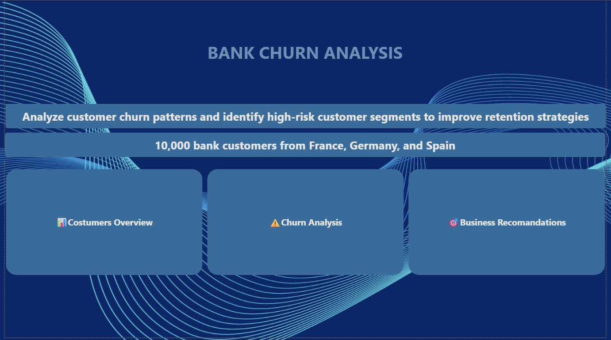

# 🏦 Bank Customer Churn Analysis Dashboard

## 📌 Project Overview

This project presents an end-to-end customer churn analysis solution built in Power BI using data from 10,000 bank customers across France, Germany, and Spain.

The dashboard helps identify churn patterns, high-risk customer segments, geographic trends, and customer behavior insights to support data-driven retention strategies.

---

## 🎯 Business Problem

Customer churn directly impacts revenue and customer lifetime value. This project aims to:

- Identify customers most likely to churn
- Analyze churn drivers across demographics and regions
- Understand the relationship between customer activity and churn
- Provide actionable recommendations to improve retention

---

## 🛠️ Tools & Technologies

- Power BI
- Power Query
- DAX
- Data Modeling
- Data Visualization

---

## 📊 Dataset Information

| Metric | Value |
|----------|----------|
| Total Customers | 10,000 |
| Countries | France, Germany, Spain |
| Retained Customers | 7,963 |
| Churned Customers | 2,037 |
| Overall Churn Rate | 20.37% |

---

# 🏠 Dashboard Home



The landing page provides navigation to all dashboard sections and summarizes the project objective:

**Analyze customer churn patterns and identify high-risk customer segments to improve retention strategies.**

---

# 👥 Customer Overview


### Key KPIs

| KPI | Value |
|------|------|
| Total Customers | 10K |
| Retained Customers | 8K |
| Churned Customers | 2K |
| Churn Rate | 20.37% |

### Key Insights

- Germany has the highest churn rate at **32.44%**
- Spain churn rate: **16.67%**
- France churn rate: **16.16%**
- Average Credit Score: **650.57**
- Customer distribution:
  - France: **5,018**
  - Germany: **2,509**
  - Spain: **2,477**
- Active and inactive customer populations are nearly balanced

---

# ⚠️ Churn Analysis


### Customer Metrics

| KPI | Value |
|------|------|
| Active Customers | 5K |
| Credit Card Holders | 51.50% |
| Average Salary | 99.74K |
| Average Balance | 76.49K |

### Churn Rate by Age Group

| Age Group | Churn Rate |
|------------|------------|
| 46–55 | 50.57% |
| 55+ | 36.75% |
| 36–45 | 19.65% |
| 26–35 | 8.49% |
| 18–25 | 7.49% |

### Key Insights

- Customers aged **46–55** have the highest churn risk.
- Churn increases significantly among older customer segments.
- Inactive members are substantially more likely to churn.
- Customers with multiple products show elevated churn tendencies.
- Gender differences have a relatively smaller impact on churn behavior.

---

# 🎯 Business Recommendations


### High-Risk Segments

| Category | Finding |
|-----------|----------|
| Highest Risk Country | Germany |
| Highest Risk Age Group | 46–55 |
| Average Products per Customer | 1.53 |
| Active Customers | 51.50% |

### Recommended Actions

✅ Launch targeted retention campaigns for customers aged 46–55.

✅ Increase engagement programs for inactive customers.

✅ Prioritize churn reduction initiatives in Germany.

✅ Review product offerings for customers with multiple products.

✅ Strengthen customer relationship management through proactive outreach.

---

# 📈 Executive Summary

### Geographic Risk

Germany records the highest churn rate (**32.44%**) and should be the primary focus of retention efforts.

### Demographic Risk

Customers aged **46–55** represent the highest-risk segment with a churn rate exceeding **50%**.

### Activity Risk

Inactive customers exhibit significantly higher churn behavior than active customers.

### Product Risk

Customers holding multiple banking products show increased churn rates, indicating possible product dissatisfaction or complexity.

---

## 📂 Repository Structure

```text
bank-churn-analysis
│
├── Bank_Churn1.pbix
├── README.md
│
└── Screenshots
    ├── Home.png
    ├── Costumer Overview.png
    ├── Churn Analysis.png
    └── Business Recomandations.png
```

---

## 🚀 Skills Demonstrated

- Data Cleaning
- Data Transformation
- Data Modeling
- DAX Calculations
- KPI Development
- Customer Churn Analytics
- Business Intelligence
- Dashboard Design
- Data Storytelling

---

## 👨‍💻 Author

### Divyanshu Panwar

Data Analyst

**Skills:** Power BI • SQL • Excel • Python • Data Visualization • Business Analytics

---

⭐ If you found this project valuable, please consider starring the repository.
